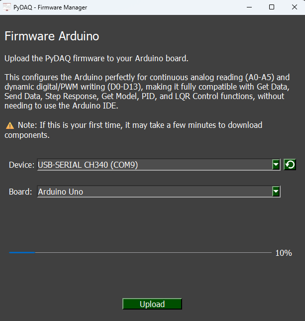

# Arduino Unified Firmware

To use Arduino boards with PYDAQ, a specific firmware must be flashed onto the microcontroller. This firmware acts as a bridge, translating high-level Python commands into hardware actions, such as reading analog sensors or writing PWM/digital signals.

You only need to upload this code to your Arduino once, and it will work seamlessly across all PYDAQ tools (Get Data, Send Data, Step Response, PID Control, and LQR Control).

## Key Features

* **One Firmware for Everything:** A single `.ino` file handles all data acquisition and control routines simultaneously.
* **Multi-Channel Support:** It supports reading from up to 6 Analog Inputs (A0 to A5) and writing to up to 14 Digital/PWM Outputs (D0 to D13) at the same time.
* **Dynamic Configuration:** You **do not** need to edit the C++ code to change pins. Channel selection is handled dynamically within your Python script or the PYDAQ GUI.
* **Universal Protocol:** Uses a lightweight, high-speed serial communication protocol based on comma-separated values to ensure fast data rates and low latency.
* **Default Specifications:** Operates with a 10-bit ADC resolution (0 to 1023) mapping to a 0V to 5V input/output range.

## How to Upload the Firmware

There are two ways to flash the firmware onto your Arduino board:

### Method 1: Automated Upload via PYDAQ GUI (Recommended)
The easiest way to get your board ready is directly through the PYDAQ interface. The software has an embedded `arduino-cli` engine that automatically handles board indexing, core installations, compilation, and flashing.

#### Uploading the Firmware using Graphical User Interface (GUI)
Using the GUI to upload the firmware is really straightforward and requires only two lines of code:

```python
from pydaq.pydaq_global import PydaqGui

# Launch the interface
PydaqGui()
```

After this command, the graphical user interface screen will show up, where the user should go to the top menu bar, click on the **Arduino** option, and select **Firmware** to open the flashing interface.



> **⚠️ First-Time Setup Note:** If this is your first time using an Arduino on this computer, PYDAQ will need to download the essential core packages in the background. During this initial process, **Windows may show security prompts** asking for permission to install USB drivers or allow network access. Please click **"Yes"** or **"Install"** to ensure your board is properly recognized.

#### Execution Steps:
1. Connect your Arduino to the computer via USB.
2. Launch the PYDAQ GUI using `PydaqGui()`.
3. On the top menu bar, click on **Arduino - Firmware**.
4. Select your board's COM port from the dropdown menu (use the reload button if it doesn't appear).
5. Select your Arduino board model from the **Board** dropdown menu. The available boards are:
   * Arduino Uno
   * Arduino Mega
   * Arduino Nano
   * Arduino Leonardo
6. Click **Upload**. Wait for the progress bar to complete and the success message to appear.


### Method 2: Manual Upload via Arduino IDE
If you prefer the traditional method or are facing USB permission issues on your operating system:

1. Download the unified firmware from the official repository: [PYDAQ Arduino Code](https://github.com/samirmartins/pydaq/tree/main/pydaq/arduino_code).
2. Open the `arduino_code.ino` file in the **Arduino IDE**.
3. Go to `Tools > Board` and select your Arduino model (e.g., Arduino Uno).
4. Go to `Tools > Port` and select the port your board is connected to.
5. Click the **Upload** button (right arrow icon) and wait for the "Done uploading" message.

Once the upload is complete, your board is fully ready to be used with any PYDAQ application!
