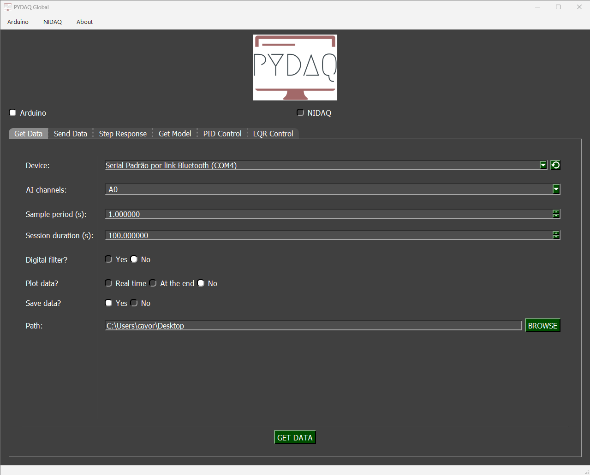
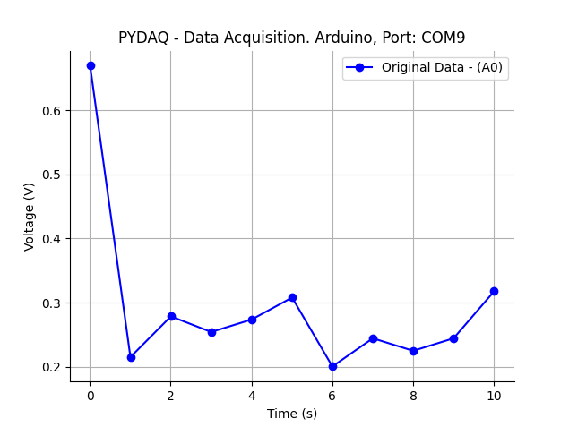
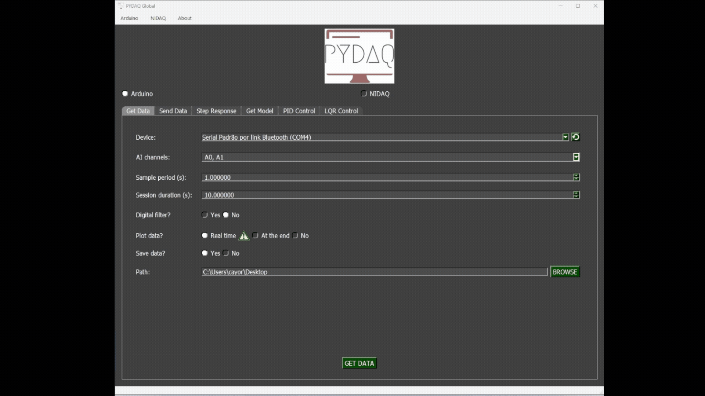

# Data Acquisition with Arduino

**NOTE 1**: before working with PYDAQ, device driver should be installed and working correctly as a DAQ (Data
Acquisition) device

**NOTE 2** To acquire/send data with an Arduino board, the unified firmware provided here (located
at [arduino_code](https://github.com/samirmartins/pydaq/tree/main/pydaq/arduino_code)) must be uploaded to the Arduino first. Starting from v0.0.7, this single firmware supports multi-channel acquisition (A0 to A5) and sending (D0 to D13) simultaneously via serial CSV communication. There is no need to modify the .ino code to change ports; channel selection is now handled entirely within your Python script or GUI.

**NOTE 3** PYDAQ is programmed to use 10 bits as a ADC resolution, and 0V and 5V as the input range.
To change this, the user can alter the following variables:

```python
self.arduino_ai_bits = 10
self.ard_ai_max = 5
self.ard_ai_min = 0
```

## Data Acquisition using Graphical User Interface (GUI)

Using GUI to acquire data is really straightforward and require only
two LOC (lines of code):

```python
from pydaq.pydaq_global import PydaqGui

# Launch the interface
PydaqGui()
```

After this command, the following screen will show up, where the
user should select the Arduino option and go to the Get Data tab,
to be able to define parameters and start to acquire data.



The user is now able to select desired device, sample period and session duration. Also,
the user will define if the data will or not be plotted and saved, as well as the path to
save data.

## Data Acquisition using command line

It will be presented how to use GetData (and get_data_arduino) to acquire signal using an Arduino board.

Firstly, import library and define parameters:

```python
# Importing PYDAQ
from pydaq.get_data import GetData

# Defining parameters
sample_period_in_seconds = 1
session_duration_in_seconds = 10.0
com_port_arduino = 'COM3'
channels_used = ['A0', 'A1']
save_data = True
will_plot = "no" # Can be realtime, end or no
```

Then, instantiate a class with defined parameters and get the data

```python
# Class GetData
g = GetData(com=com_port_arduino,
            ts=sample_period_in_seconds,
            channels=channels_used,
            session_duration=session_duration_in_seconds,
            save=save_data,
            plot_mode=will_plot)

# Method get_data_arduino
g.get_data_arduino()
```

**NOTE**: data will be saved on desktop, by default. To change the path the user can define "g.path = Desired path"

## Presenting acquired data

To show acquired data, type:

```python
print(f"First 10 values of time (Channel A0): \n {g.time_var['A0'][0:10]}")
print(f"\nFirst 10 values of data (Channel A0): \n {g.data['A0'][0:10]}")
```

If you choose to plot you can see acquired data on screen, i.e:



Data will also be saved as depicted below:


You can see more detailed below:


