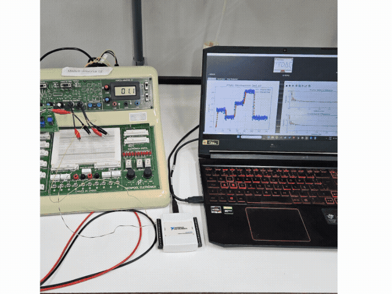

<p align="center">
  
</p>

PYDAQ is a Python package for data acquisition, signal generation, system identification, digital filtering, and real-time control using Arduino and National Instruments DAQ devices.

It provides a unified graphical interface, command-line tools, and Jupyter notebook examples for laboratory experiments, rapid prototyping, teaching, and research workflows.

---

## Capabilities

PYDAQ supports the following experimental workflows:

| Capability | Description |
| :--- | :--- |
| Data acquisition | Acquire, plot, and save experimental data from Arduino or National Instruments DAQ boards |
| Signal generation | Send user-defined input signals, including nonlinear excitation signals |
| Step-response experiments | Run automatic step-response tests and save the resulting data |
| PRBS-based experiments | Generate excitation signals for system identification workflows |
| System identification | Estimate linear and nonlinear black-box models from experimental data using [SysIdentPy](https://www.sysidentpy.org) |
| Digital filtering | Apply FIR and IIR filters directly to acquired data in real time |
| PID control | Run real-time or simulated P, PI, PD, and PID control with Ziegler-Nichols tuning |
| LQR control | Simulate or implement Linear Quadratic Regulator control for state-space systems |
| Multi-channel workflows | Work with multiple Arduino or National Instruments DAQ channels |
| Benchmarking | Estimate the maximum reliable sampling frequency supported by the local system |

---

## Installation

Install PYDAQ with `pip`:

```console
pip install pydaq
```

**Hardware notes:**

- Arduino workflows do not require NI-DAQmx drivers.
- National Instruments DAQ workflows require the [NI-DAQmx drivers](https://www.ni.com/en/support/downloads/drivers/download.ni-daq-mx.html#494676).

PYDAQ is tested up to Python 3.14. It may run on newer versions, but without guarantees.

---

## Graphical user interface

All main workflows are available from a single graphical interface.

Launch the GUI with:

```python
from pydaq.pydaq_global import PydaqGui

PydaqGui()
```

---

## Documentation map

### Data acquisition

Acquire, plot, and save experimental data using:

- [NI-DAQ](get_data_nidaq.md)
- [Arduino](get_data_arduino.md)

### Signal generation

Generate and send user-defined excitation signals using:

- [NI-DAQ](send_data_nidaq.md)
- [Arduino](send_data_arduino.md)

### Step-response experiments

Run automatic step-response experiments using:

- [NI-DAQ](step_response_nidaq.md)
- [Arduino](step_response_arduino.md)

### System identification

Estimate mathematical models from experimental data using:

- [NI-DAQ](get_model_nidaq.md)
- [Arduino](get_model_arduino.md)

### PID control

Run real-time or simulated PID control experiments using:

- [NI-DAQ](pid_control_nidaq.md)
- [Arduino](pid_control_arduino.md)

### LQR control

Simulate or implement Linear Quadratic Regulator control for state-space systems using:

- [NI-DAQ](lqr_control_nidaq.md)
- [Arduino](lqr_control_arduino.md)

### Digital filtering

Design and apply FIR and IIR digital filters in real time using:

- [NI-DAQ](digital_filters_nidaq.md)
- [Arduino](digital_filters_arduino.md)

### Benchmarking

Estimate the maximum reliable sampling frequency supported by the local system:

- [Benchmarking tool](benchmarking.md)

### Arduino firmware

PYDAQ uses a unified Arduino firmware based on a standardized CSV serial protocol for multi-channel acquisition, signal generation, system identification, filtering, and control workflows.

- [Arduino firmware](arduino_firmware.md)

### Error dictionary

The error dictionary helps diagnose common GUI messages, terminal outputs, communication issues, and configuration problems.

- [Error dictionary](error_dictionary.md)

### Jupyter notebook examples

Notebook examples are available for both Arduino and National Instruments DAQ workflows:

- [Jupyter notebook examples](jupyter_notebooks.md)

---

## Screenshots

<p align="center">
  
</p>

---

## Citation

[](https://doi.org/10.21105/joss.05662)

This is the **seminal publication** of the PYDAQ project and should be cited in any work that uses PYDAQ.

- Martins, S. A. M. (2023). *PYDAQ: Data Acquisition and Experimental Analysis with Python*. Journal of Open Source Software, 8(92), 5662. https://doi.org/10.21105/joss.05662

```bibtex
@article{Martins_PYDAQ_Data_Acquisition_2023,
  author  = {Martins, Samir Angelo Milani},
  doi     = {10.21105/joss.05662},
  journal = {Journal of Open Source Software},
  month   = dec,
  number  = {92},
  pages   = {5662},
  title   = {{PYDAQ: Data Acquisition and Experimental Analysis with Python}},
  url     = {https://joss.theoj.org/papers/10.21105/joss.05662},
  volume  = {8},
  year    = {2023}
}
```

Additional related publications are available in the [`papers`](https://github.com/samirmartins/pydaq/tree/main/papers) directory.
