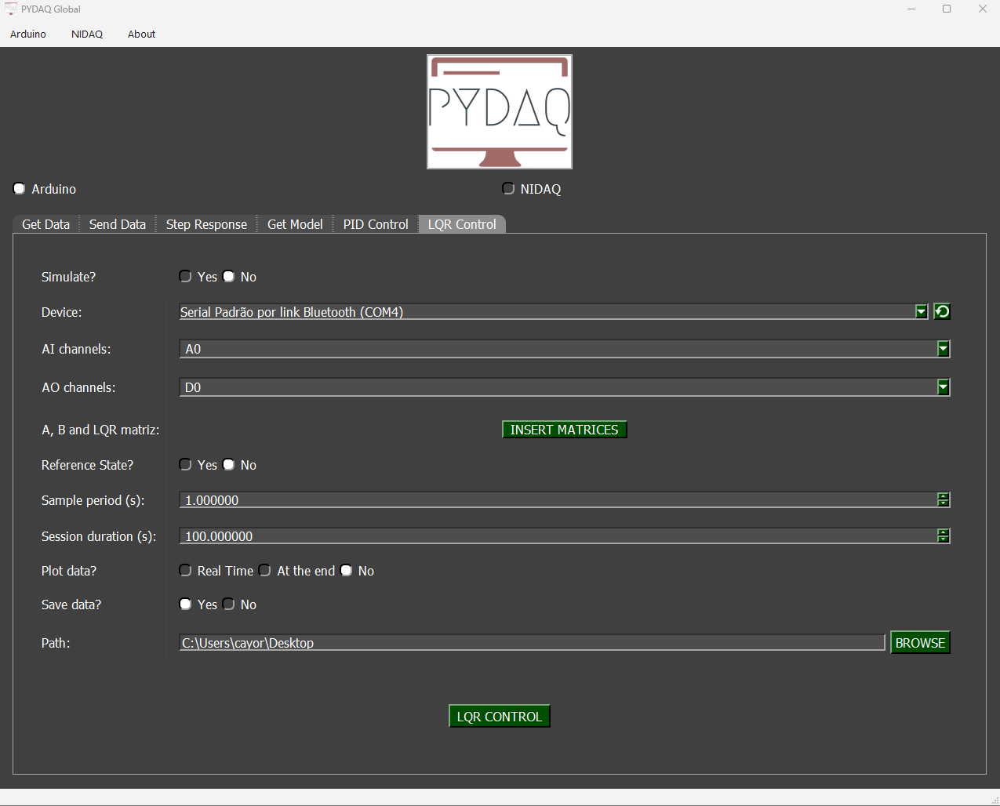
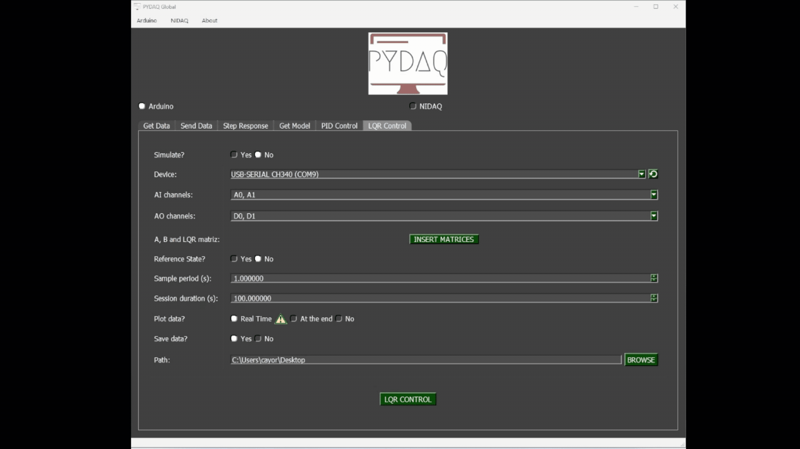

# LQR Control with Arduino boards

**NOTE 1**: before working with PYDAQ, device driver should be installed and working correctly as a DAQ (Data Acquisition) device.

**NOTE 2**: To acquire/send data with an Arduino board, the unified firmware provided here (located at [arduino_code](https://github.com/samirmartins/pydaq/tree/main/pydaq/arduino_code)) must be uploaded to the Arduino first. Starting from v0.0.7, this single firmware supports multi-channel acquisition (A0 to A5) and sending (D0 to D13) simultaneously via serial CSV communication. There is no need to modify the .ino code to change ports; channel selection is now handled entirely within your Python script or GUI.

**NOTE 3**: LQR (Linear Quadratic Regulator) control requires defining the state-space matrices (A, B, C, D) of your system, as well as the weight matrices (Q and R) to calculate the optimal gain matrix K. Since digital output ports are used, the control effort output will be bounded between 0V and 5V.

**NOTE 4**: The matrices provided to the PYDAQ interface or script MUST be in their **discrete-time** form (A_d, B_d, C_d, D_d). The library assumes that the user has already discretized the continuous system model using a method of their choice (e.g., Euler or Zero-Order Hold) according to the defined sample period (`ts`).

**NOTE 5**: The PYDAQ LQR interface allows users to define state references (X_ref) and equilibrium inputs (U_eq) for setpoint tracking through a dedicated widget. Within this interface, users can choose whether the reference will be a fixed point or a dynamic trajectory using a tabbed menu. The first tab allows manual data entry into tables, which applies a fixed reference throughout the acquisition. Alternatively, the second tab allows users to load `.dat` or `.txt` files. When using files, the system's logic automatically determines the mode: a file with a single row of data is treated as a fixed reference, while a file with multiple rows is processed step-by-step as a time-varying trajectory. For a formatting example, check the `trajectory_test.txt` file located in the `examples/` folder on our GitHub repository.

## LQR Control using Graphical User Interface (GUI)

Using the GUI for LQR control is really straightforward and requires only two LOC (lines of code):

```python
from pydaq.pydaq_global import PydaqGui

# Launch the interface
PydaqGui()
```

After this command, the graphical user interface screen will show up, where the user should select the Arduino option and go to the LQR Control tab, to be able to define parameters and start the control loop.



The user is now able to select the desired Arduino and sample period, as well as input the system matrices and tuning weights (Q and R). Also, the user will define if the data will or not be plotted and saved.

## LQR Control using command line

It will be presented how to use LQRControl (and lqr_control_arduino) to perform an optimal closed-loop control experiment using an Arduino board.

Firstly, import library and define parameters:

```python
# Importing PYDAQ
from pydaq.lqr_control import LQRControl

# Defining LQR Matrices (Example for a 2-state, 1-input system)
A_matrix = [[1.0, 0.1], 
            [0.0, 1.0]]
B_matrix = [[0.005], 
            [0.1]]
Q_matrix = [[10.0, 0.0], 
            [0.0, 1.0]]
R_matrix = [[0.1]]
```

Then, instantiate a class with defined parameters and start the control loop:

```python
# Instantiate the LQRControl class
l = LQRControl(
    com="COM7",
    ts=0.1,
    session_duration=10.0,
    plot_mode="realtime",  # Options: "realtime", "end", or "no"
    save=True
)

# Set multi-channel configuration explicitly
l.channels = ['A0', 'A1']    # AI channels (Must match the number of states)
l.ao_channels = ['D3']       # AO channel (Must match the number of inputs)

# Assign matrices
l.A, l.B, l.Q, l.R = A_matrix, B_matrix, Q_matrix, R_matrix

# Execute control loop
l.lqr_control_arduino()
```

If you choose to plot, you can see the system states and the control effort sent on screen, i.e:

