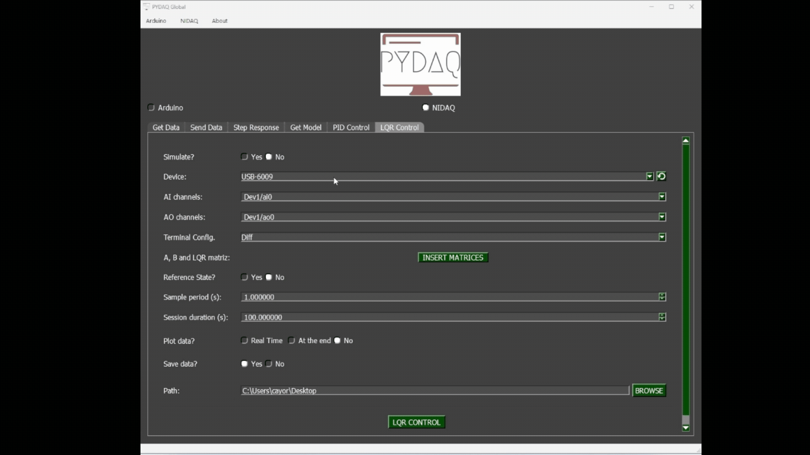

# LQR Control with NI-DAQ boards

**NOTE 1**: before working with PYDAQ, device driver should be installed and working correctly as a DAQ (Data Acquisition) device.

**NOTE 2**: LQR (Linear Quadratic Regulator) control requires defining the state-space matrices (A, B, C, D) of your system, as well as the weight matrices (Q and R) to calculate the optimal gain matrix K. Analog output ranges should be configured according to your system hardware limits.

**NOTE 3**: The matrices provided to the PYDAQ interface or script MUST be in their **discrete-time** form (A_d, B_d, C_d, D_d). The library assumes that the user has already discretized the continuous system model using a method of their choice (e.g., Euler or Zero-Order Hold) according to the defined sample period (`ts`).

**NOTE 4**: The PYDAQ LQR interface allows users to define state references (x_{ref}) and equilibrium inputs (u_{eq}) for setpoint tracking through a dedicated widget. Within this interface, users can choose whether the reference will be a fixed point or a dynamic trajectory using a tabbed menu. The first tab allows manual data entry into tables, which applies a fixed reference throughout the acquisition. Alternatively, the second tab allows users to load `.dat` or `.txt` files. When using files, the system's logic automatically determines the mode: a file with a single row of data is treated as a fixed reference, while a file with multiple rows is processed step-by-step as a time-varying trajectory. For a formatting example, check the `trajectory_test.txt` file located in the `examples/` folder on our GitHub repository.

Regardless of whether a fixed setpoint or a dynamic trajectory is selected, the regulator actively computes the following state-space control equations at each sampling period:

1. **State Error Vector Calculation (e):**
   Defines the deviation of the current measured state vector (x) acquired from the NI-DAQ analog input channels from the desired reference vector (x_{ref\_vec}):
   e = x - x_{ref\_vec}

2. **Optimal Control Effort (u):**
   Computes the multi-input optimal control action to be sent to the plant via the NI-DAQ analog output channels. It combines the optimal state-feedback gains (K) with the feedforward equilibrium input vector (u_{eq\_vec}) to track trajectories with zero steady-state error:
   u = -K \cdot e + u_{eq\_vec}

*Note: The calculated control effort u is automatically clipped/saturated between the minimum and maximum voltage constraints configured in the interface (typically 0V to 5V) before being written directly to the National Instruments analog output task.*

## LQR Control using Graphical User Interface (GUI)

Using the GUI for LQR control is really straightforward and requires only two LOC (lines of code):

```python
from pydaq.pydaq_global import PydaqGui

# Launch the interface
PydaqGui()
```

After this command, the graphical user interface screen will show up, where the user should select the NI-DAQ option and go to the LQR Control tab, to be able to define parameters and start the control loop.


The user is now able to select the desired NI-DAQ device, analog input and analog output channels, as well as the analog input terminal configuration (e.g., Differential, RSE, NRSE). The user can also input the system matrices and tuning weights (Q and R), and adjust the sample period. Also, the user will define if the data will or not be plotted and saved.

## LQR Control using command line

It will be presented how to use LQRControl (and lqr_control_nidaq) to perform an optimal closed-loop control experiment using an NI-DAQ board.

Firstly, import the library and define the parameters:

```python
# Importing PYDAQ
from pydaq.lqr_control import LQRControl

# Defining LQR Matrices (Example for a 2-state, 1-input system)
A_matrix = [[1.0, 0.1], 
            [0.0, 1.0]]
B_matrix = [[0.005], 
            [0.1]]
Q_matrix = [[10.0, 0.0], 
            [0.0, 1.0]]
R_matrix = [[0.1]]
```

Then, instantiate a class with the defined parameters and start the control loop:

```python
# Instantiate the LQRControl class
l = LQRControl(
    device="Dev1",
    terminal="RSE",        # Terminal configuration: 'Diff', 'RSE', or 'NRSE'
    ts=0.1,
    session_duration=10.0,
    plot_mode="realtime",  # Options: "realtime", "end", or "no"
    save=True
)

# Set multi-channel configuration explicitly
l.channels = ['ai0', 'ai1']  # AI channels (Must match the number of states)
l.ao_channels = ['ao0']      # AO channel (Must match the number of inputs)

# Assign matrices
l.A, l.B, l.Q, l.R = A_matrix, B_matrix, Q_matrix, R_matrix

# Execute control loop
l.lqr_control_nidaq()
```

If you choose to plot, you can see the system states and the control effort sent on screen, i.e:


