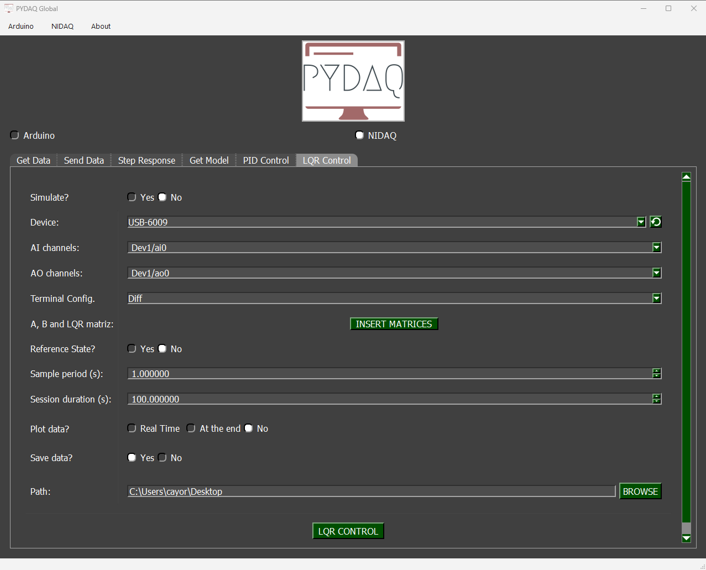

# LQR Control with NIDAQ boards

**NOTE 1**: before working with PYDAQ, device driver should be installed and working correctly as a DAQ (Data Acquisition) device.

**NOTE 2**: LQR (Linear Quadratic Regulator) control requires defining the state-space matrices ($A$, $B$, $C$, $D$) of your system, as well as the weight matrices ($Q$ and $R$) to calculate the optimal gain matrix $K$. Analog output ranges should be configured according to your system hardware limits.

## LQR Control using Graphical User Interface (GUI)

Using the GUI for LQR control is really straightforward and requires only two LOC (lines of code):

```python
from pydaq.pydaq_global import PydaqGui

# Launch the interface
PydaqGui()
```

After this command, the graphical user interface screen will show up, where the user should select the NIDAQ option and go to the LQR Control tab, to be able to define parameters and start the control loop.



The user is now able to select the desired NIDAQ device, analog input and analog output channels, as well as the analog input terminal configuration (e.g., Differential, RSE, NRSE). The user can also input the system matrices and tuning weights ($Q$ and $R$), and adjust the sample period. Also, the user will define if the data will or not be plotted and saved.

## LQR Control using command line

It will be presented how to use LQRControl (and lqr_control_nidaq) to perform an optimal closed-loop control experiment using a National Instruments board.

Firstly, import the library and define the parameters:

```python
# Importing PYDAQ
from pydaq.lqr_control import LQRControl

# Defining LQR Matrices (Example for a 2-state, 1-input system)
A_matrix = [[1.0, 0.1], 
            [0.0, 1.0]]
B_matrix = [[0.005], 
            [0.1]]
Q_matrix = [[10.0, 0.0], 
            [0.0, 1.0]]
R_matrix = [[0.1]]
```

Then, instantiate a class with the defined parameters and start the control loop:

```python
# Instantiate the LQRControl class
l = LQRControl(
    device="Dev1",
    terminal="RSE",        # Terminal configuration: 'Diff', 'RSE', or 'NRSE'
    ts=0.1,
    session_duration=10.0,
    plot_mode="realtime",  # Options: "realtime", "end", or "no"
    save=True
)

# Set multi-channel configuration explicitly
l.channels = ['ai0', 'ai1']  # AI channels (Must match the number of states)
l.ao_channels = ['ao0']      # AO channel (Must match the number of inputs)

# Assign matrices
l.A, l.B, l.Q, l.R = A_matrix, B_matrix, Q_matrix, R_matrix

# Execute control loop
l.lqr_control_nidaq()
```

If you choose to plot, you can see the system states and the control effort sent on screen, i.e:

