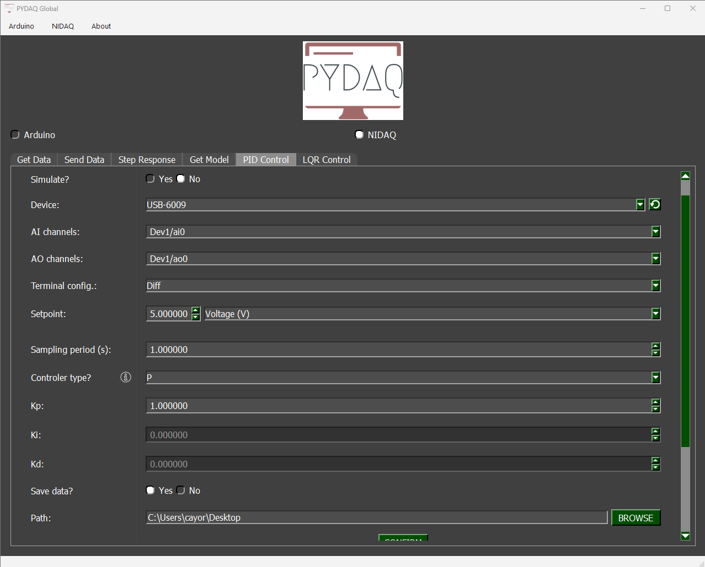
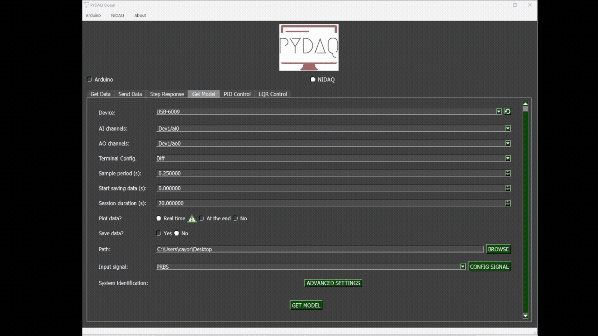

# PID Control with NIDAQ

**NOTE**: Before working with PYDAQ, the device driver should be installed and working correctly as a DAQ (Data Acquisition) device.

## Controlling using Graphical User Interface (GUI)

Using the GUI to perform PID control is very straightforward and requires only two lines of code:

```python
from pydaq.pydaq_global import PydaqGui

PydaqGui()
```

After running the command, the GUI will appear. Navigate to the "PID Control" screen, where you can define the parameters and start the control session.



## Parameters

- **Simulate**: If this option is selected, you can enter a mathematical equation to simulate a system and apply PID control to it.

- **Device**: Select the NIDAQ board connected to your system.

- **AI channel and AO channel**: Specify the analog input (AI) and output (AO) channels used by your device.

- **Terminal Configuration**: The user can change terminal configuration (Differential, RSE and NRSE).

- **Setpoint**: Define the desired reference value for the system.

- **Unit** *(optional)*: Define the unit of measurement for the setpoint (e.g., °C, rpm, volts).

- **Equation** *(optional)*: Define a mathematical transformation for the measured input, if needed.

- **Sampling period**: Time interval (in seconds) between each data sample.

- **Controller type**: Choose among P, PI, PD, or PID controllers and configure their respective tuning parameters.

- **Save data**: Choose whether to save the recorded data during the session.

- **Path**: Define where the data files will be saved.

## Simulated System

If you enable the **Simulate** option, the software will not require a physical device. Instead, you can input the transfer function or system equation, and PYDAQ will simulate its response using the defined controller parameters.

This is useful for testing your control strategy before applying it to a real system.

## Real-Time Control

After adjusting the parameters and starting the control, a new window will open to display the real-time control process. Within this window, you can also modify the PID parameters (**kp**, **ki**, **kd**) and the **setpoint** during execution.

A disturbance input can also be simulated during real-time control. It acts as a negative signal added after the control signal, as illustrated in the figure below.

## Example GIF



# Control PID with NIDAQ (GUI via code)

It is possible to access the PID Control GUI directly with a few lines of code. This allows you to hardcode your hardware and controller settings for faster testing and deployment, bypassing the initial setup screens.

## Example

The following code demonstrates how to set up and launch the control interface for an NI-DAQ device, set the analog/digital channels, and launch the control interface with predefined PID parameters.

```python
import sys
from PySide6.QtWidgets import QApplication
from pydaq.guis.pid_control_window_dialog import PID_Control_Window_Dialog

app = QApplication(sys.argv)
plot_window = PID_Control_Window_Dialog()

# 1. Hardware Configuration
plot_window.check_board(
    board="nidaq", 
    hardware_id="Dev1", 
    ao=['ao0'], 
    ai=['ai0'], 
    terminal="RSE", 
    simulate=False
)

# 2. Controller & Logging Parameters
plot_window.set_parameters(
    kp=1.0, ki=0.2, kd=0.05, index=3, 
    numerator=None, denominator=None, 
    setpoint=2.0, unit="Voltage (V)", 
    equationvu="", equationuv="", 
    period=0.1, path=None, save=True
)

# 3. Launch the Application
plot_window.exec()
```

### Understanding the Methods

#### `check_board()`
This method injects the hardware configuration into the PyDAQ window.
* **`board`**: Type of board (`'nidaq'` or `'arduino'`).
* **`hardware_id`**: The name of the NI-DAQ device configured in NI MAX (e.g., `'Dev1'`, `'Dev2'`).
* **`ai` / `ao`**: Lists defining the Analog Input channels (Sensors) and Analog Output channels (Actuators). For NI-DAQ, these are usually formatted like `['ai0', 'ai1']` and `['ao0', 'ao1']`. *Note: The number of AI and AO channels must match.*
* **`terminal`**: The terminal configuration for the NI-DAQ inputs (e.g., `'RSE'`, `'Diff'`, or `'NRSE'`).
* **`simulate`**: Set to `True` to run a mathematical simulation without hardware.

#### `set_parameters()`
This method sets the initial tuning for your controller and defines how data is saved. Pass `None` or `""` to fields you don't need to override.
* **`kp`, `ki`, `kd`**: Proportional, Integral, and Derivative gains.
* **`index`**: Controller Type (`0` = P, `1` = PI, `2` = PD, `3` = PID).
* **`setpoint`**: The target value the controller will try to reach.
* **`period`**: Sample period in seconds (e.g., `0.1` equals a 10Hz sampling rate).
* **`unit`**: The Y-axis label for the plot.
* **`path` / `save`**: Destination folder for `.dat` files. If `path` is `None`, it defaults to the user's Desktop. Set `save=True` to automatically save data when the window is closed.

#### `exec()`
Opens the control interface and starts the Qt event loop. This blocks the script until the window is closed by the user.

### Summary of Execution
* **`check_board`**: Selects NI-DAQ as the control device and configures the device name, channels, and terminal settings.
* **`set_parameters`**: Sets gains, setpoint, sampling period, and save path.
* **`exec()`**: Opens the real-time control interface.