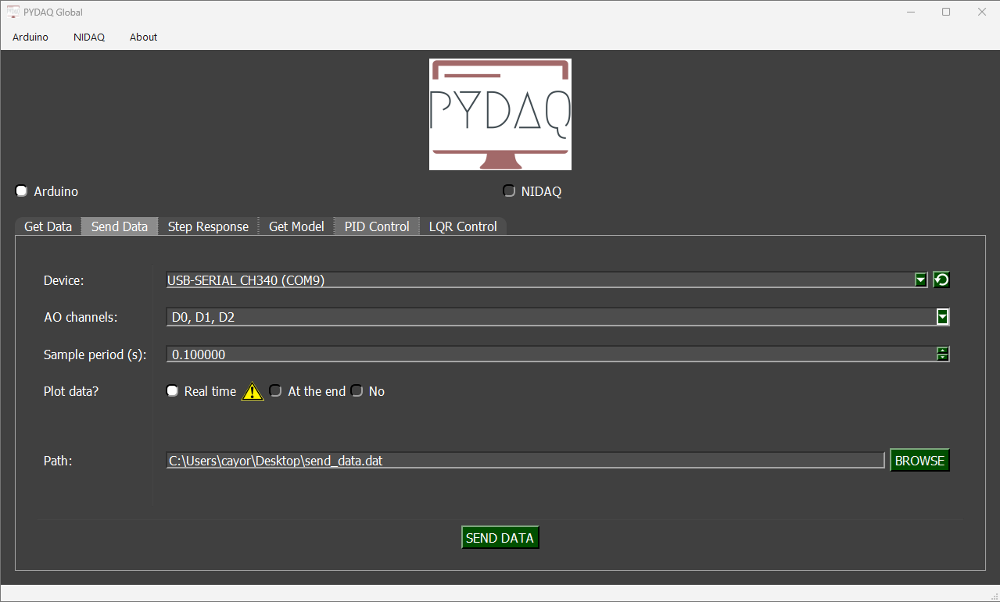
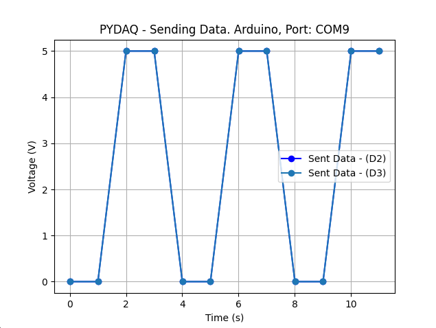
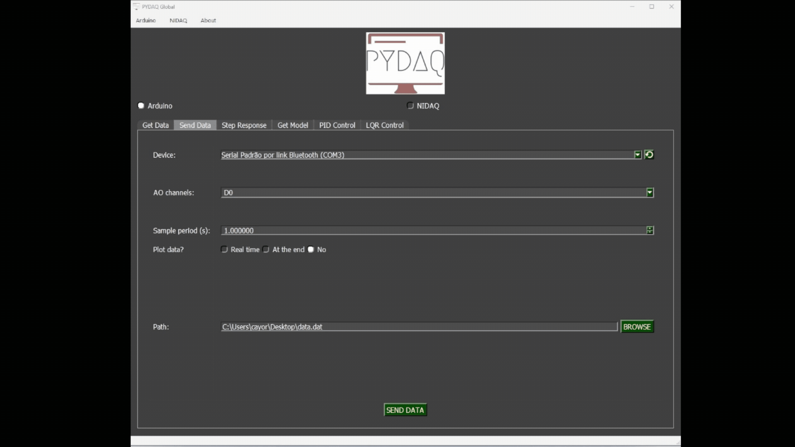

# Sending Data with Arduino Boards

**NOTE 1**: before using PYDAQ with an Arduino board, make sure the board is recognized by your operating system as a USB/serial device. If the COM port does not appear in PYDAQ, install the required USB driver for your board, such as the Arduino IDE drivers or the CH340/CH341 driver for compatible boards, and reconnect the device.

**NOTE 2**: to acquire/send data with an Arduino board, the unified firmware provided here (located
at [arduino_code](https://github.com/samirmartins/pydaq/tree/main/pydaq/arduino_code)) must be uploaded to the Arduino first. Starting from v0.0.7, this single firmware supports multi-channel acquisition (A0 to A5) and sending (D0 to D13) simultaneously via serial CSV communication. There is no need to modify the .ino code to change ports; channel selection is now handled entirely within your Python script or GUI.

**NOTE 3**: since digital output ports are used, the output will be
0V if data < 2.5 and 5V otherwise.

## Sending Data using Graphical User Interface (GUI)

Using GUI to send data is really straightforward and require only
two LOC (lines of code):

```python
from pydaq.pydaq_global import PydaqGui

# Launch the interface
PydaqGui()
```

After this command, the graphical user interface screen will show up, where the
user should select the Arduino option and go to the Send Data tab,
to be able to define parameters and start to send the data.



The user is now able to select desired Arduino and sample period. Also,
the user will define if the data will or not be plotted. The data that
will be sent should be in the range (0-5V).

Data should be formatted as one data
per line and saved as a .dat file. After
configuration is done, the user only needs to click on **SEND DATA** button to start the process.

## Sending data using command line

It will be presented how to use SendData (and send_data_arduino) to
send a signal using an Arduino board.

Firstly, import library and define parameters:

```python
# Importing PYDAQ
from pydaq.send_data import SendData

# Defining parameters
sample_period_in_seconds = 1
data = [0, 0, 5, 5, 0, 0, 5, 5, 0, 0, 5, 5]  # It can be either a list or a numpy array
com_port_arduino = 'COM7'
channels=['D2', 'D3'] # It can be either a list of strings or a list of integers (e.g., [2, 3])
will_plot = "realtime" # Can be realtime, end or no


```

Then, instantiate a class with defined parameters and send the data

```python
# Class SendData
s = SendData(data=data,
             com=com_port_arduino,
             channels=channels,
             ts=sample_period_in_seconds,
             plot_mode=will_plot)

# Method send_data_arduino()
s.send_data_arduino()

```

If you choose to plot you can see the data sent on screen, i.e:



You can see more detailed below:


