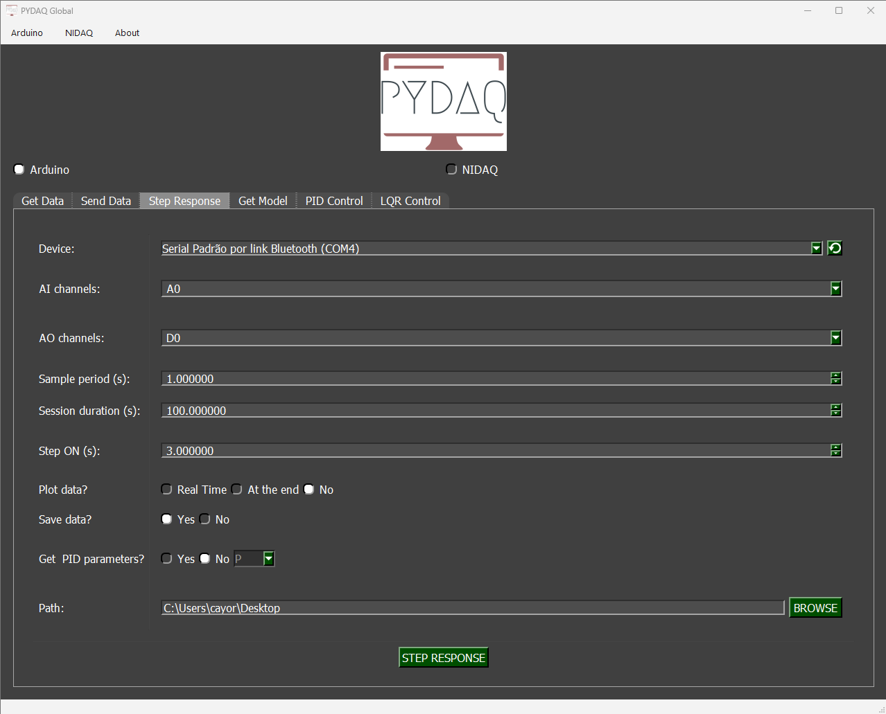
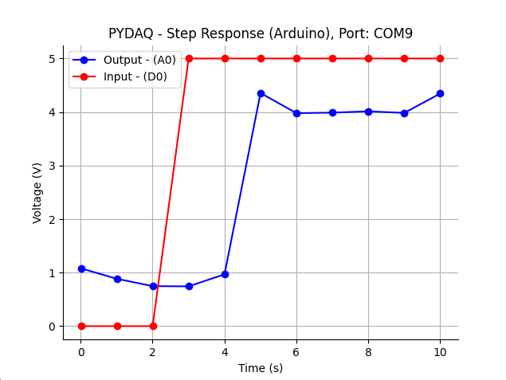
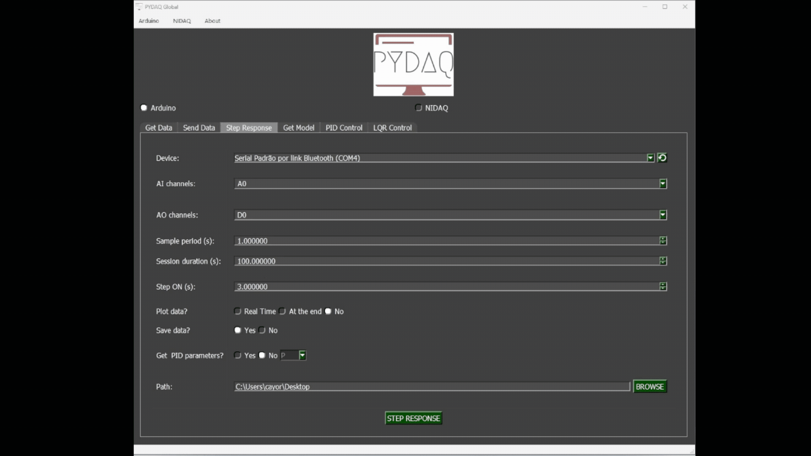

# Step response with Arduino boards

**NOTE 1**: before using PYDAQ with an Arduino board, make sure the board is recognized by your operating system as a USB/serial device. If the COM port does not appear in PYDAQ, install the required USB driver for your board, such as the Arduino IDE drivers or the CH340/CH341 driver for compatible boards, and reconnect the device.

**NOTE 2**: to acquire/send data with an Arduino board, the unified firmware provided here (located
at [arduino_code](https://github.com/samirmartins/pydaq/tree/main/pydaq/arduino_code)) must be uploaded to the Arduino first. Starting from v0.0.7, this single firmware supports multi-channel acquisition (A0 to A5) and sending (D0 to D13) simultaneously via serial CSV communication. There is no need to modify the .ino code to change ports; channel selection is now handled entirely within your Python script or GUI.

**NOTE 3**: since digital output ports are used, the output will be
0V for step minimum and 5V for step maximum.

## Step Response using Graphical User Interface (GUI)

Using GUI for step response is really straightforward and require only
two LOC (lines of code):

```python
from pydaq.pydaq_global import PydaqGui

# Launch the interface
PydaqGui()
```

After this command, the graphical user interface screen will show up, where the
user should select the Arduino option and go to the Step Response tab,
to be able to define parameters and start to acquire data.



The user is now able to select desired Arduino and sample period, as well as
the session duration and the time when the step will be on.
Also, the user will define if the data will or not be plotted and saved.

Additionally, the user can choose to **Calculate PID** tuning parameters (P, PI, or PID) based on the step response curve.

**NOTE 4:** The standard Step Response supports arbitrary MIMO (Multiple-Input Multiple-Output) configurations (e.g., selecting 2 inputs and 1 output). However, if the **Calculate PID** option is enabled, the system requires a strictly Single-Input Single-Output (SISO) configuration (exactly 1 AI and 1 AO channel).

## Step Response using command line

It will be presented how to use StepResponse (and step_response_arduino) to
perform a step response experiment using an Arduino board.

Firstly, import library and define parameters:

```python
# Importing PYDAQ
from pydaq.step_response import StepResponse

# Defining parameters
sample_period_in_seconds = 1
session_duration_in_seconds = 10.0
step_time_in_seconds = 3.0
com_port_arduino = 'COM7'
ai_channels_used = ['A0', 'A1']
ao_channels_used = ['D0', 'D1']
will_plot = "end" # Can be realtime, end or no

```


Then, instantiate a class with defined parameters and send the data

```python
# Class StepResponse
s = StepResponse(com=com_port_arduino,
                 ts=sample_period_in_seconds,
                 ai_channels = ai_channels_used,
                 ao_channels = ao_channels_used,
                 session_duration=session_duration_in_seconds,
                 step_time=step_time_in_seconds,
                 plot_mode=will_plot
                 )

# Method step_response_arduino
s.step_response_arduino()
```

If you choose to plot you can see the data sent on screen, i.e:



You can see more detailed below:


