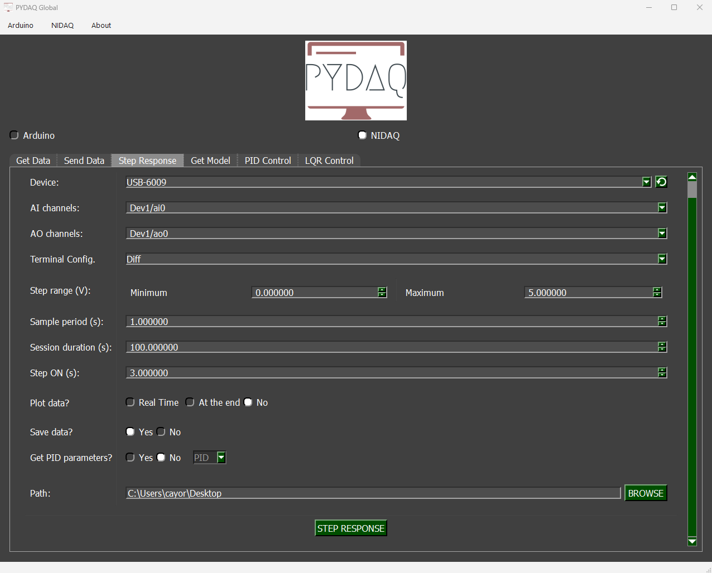
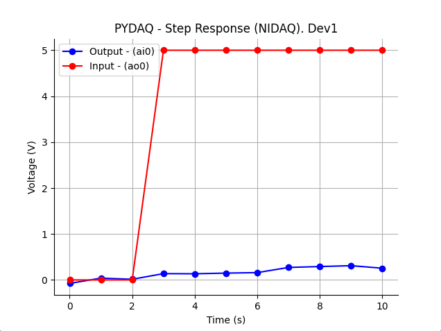
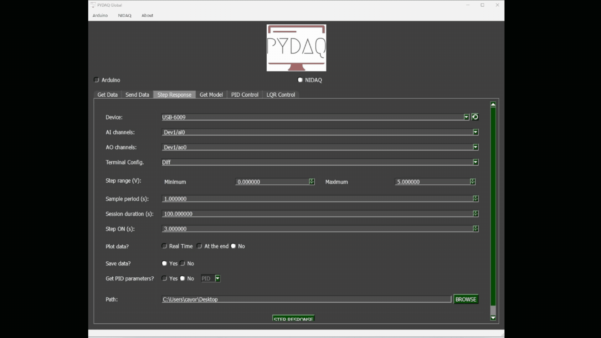

# Step response with NI-DAQ boards

**NOTE 1**: before working with PYDAQ, device driver should be installed and working correctly as a DAQ (Data
Acquisition) device

## Step Response using Graphical User Interface (GUI)

Using GUI for step response is really straightforward and require only
two LOC (lines of code):

```python
from pydaq.pydaq_global import PydaqGui

# Launch the interface
PydaqGui()
```

After this command, the graphical user interface screen will show up, where the
user should select the NI-DAQ option and go to the Step Response tab,
to be able to define parameters and start to acquire data.



The user is now able to select desired NI-DAQ device, analog input and
analog output channel, as well as analog input terminal configuration.
Step range and sample period can be adjusted along with session duration.
Step will be applied in the defined time. Also, the user will define if
the data will or not be plotted and saved.

Additionally, the user can choose to **Calculate PID** tuning parameters (P, PI, or PID) based on the step response curve.

**NOTE 2:** The standard Step Response supports arbitrary MIMO (Multiple-Input Multiple-Output) configurations (e.g., selecting 2 inputs and 1 output). However, if the **Calculate PID** option is enabled, the system requires a strictly Single-Input Single-Output (SISO) configuration (exactly 1 AI and 1 AO channel).

## Step Response using command line

It will be presented how to use StepResponse (and step_response_nidaq) to
perform a step response experiment using an NI-DAQ board.

Firstly, import library and define parameters:

```python
# Importing PYDAQ
from pydaq.step_response import StepResponse

# Defining parameters
device_name = "Dev1"
ao_channel_used = ['ao0']
ai_channel_used = ['ai0']
sample_period_in_seconds = 1
session_duration_in_seconds = 10.0
step_time_in_seconds = 3.0
step_min_in_volts = 0
step_max_in_volts = 5
terminal_configuration = 'Diff'
will_plot = "realtime" # Can be realtime, end or no
```

Then, instantiate a class with defined parameters and send the data

```python
# Class StepResponse
s = StepResponse(device=device_name,
                 ao_channels=ao_channel_used,
                 ai_channels=ai_channel_used,
                 ts=sample_period_in_seconds,
                 session_duration=session_duration_in_seconds,
                 step_time=step_time_in_seconds,
                 step_min=step_min_in_volts,
                 step_max=step_max_in_volts,
                 terminal=terminal_configuration,
                 plot_mode=will_plot)

# Method step_response_nidaq
s.step_response_nidaq()
```

If you choose to plot you can see the data sent on screen, i.e:



You can see more detailed below:


